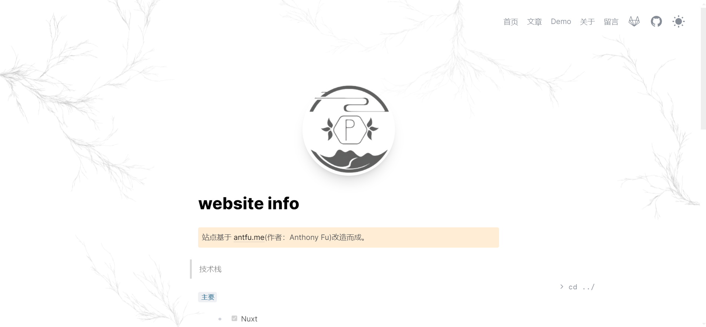
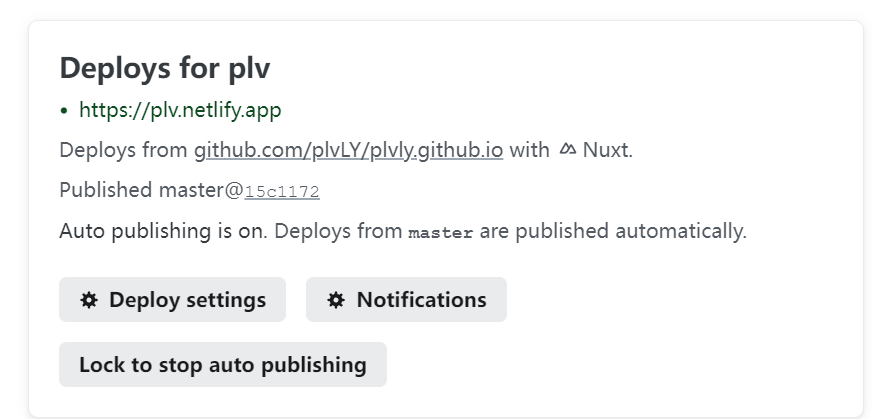

>站点链接: <a href='https://plv.netlify.app/' target="_blank">plv.app</a>
### 描述
采用Nuxt3框架搭建的一套基于文件路由的内容管理系统(markdown)

### 主要技术栈
- [x] Nuxt
- [x] Vue3
- [x] TS
- [x] UnoCSS - 高性能且极具灵活性的即时原子化 CSS 引擎

### 开发工具
- node - 18.14.1
- pnpm - 快, 节省磁盘空间的包管理器(8.10.2)
- WebStorm
- TypeScript
- Netlify - 零配置部署

### 部署 - Netlify
> 零配置部署 Netlify
1. 访问 Netlify 网站并注册：https://www.netlify.com/
2. 登录你的 Netlify 账号。
3. 在 Netlify 的顶部菜单栏点击 “GitHub” 或 “GitLab” 图标进行登录。（绑定GitHub&GitLab）
4. 授权 Netlify 访问你的 GitHub 或 GitLab 账号。
5. 选择仓库
6. Netlify 会自动检测到你的项目并且可能会提供一些部署配置选项。
7. 点击 “Deploy site” 按钮开始部署
8. 部署完成后，你将会在 Netlify 的用户界面上看到你的站点 URL。
9. 