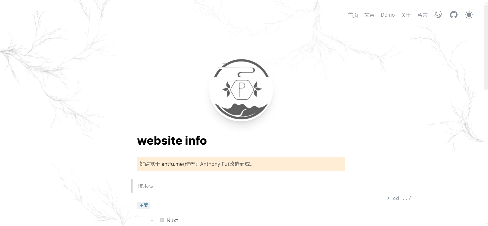

# plv.io

> 站点链接: <a href='https://plv.netlify.app/' target="_blank">plv.netlify.app</a>

### 描述
采用 Nuxt3 框架搭建的个人技术博客与作品展示站点，基于文件路由的内容管理系统（Markdown），支持集合分类、留言、访客分析等功能。部署于 Netlify，无传统数据库依赖。



### 主要技术栈
- [x] Nuxt 3 ~3.15.0 - Vue 3 元框架，文件路由、SSR/SSG
- [x] Vue 3 - Composition API、`<script setup>`
- [x] TypeScript
- [x] UnoCSS - 高性能原子化 CSS 引擎（预设：Uno、Icons、Attributify、WebFonts）
- [x] @nuxt/content - 文件驱动的 Markdown 内容管理
- [x] @netlify/blobs - 本地开发通过本地 BlobsServer 模拟，生产环境使用 Netlify Blobs 服务
- [x] @vueuse/core - 组合式工具库（useDark、useStorage 等）
- [x] unplugin-icons - 自动加载 Iconify 图标
- [x] @nuxt/image - 图片优化
- [x] dayjs - 日期格式化
- [x] vue-starport - 跨路由共享元素过渡动画
- [x] mermaid - Markdown 内 Mermaid 图表渲染

### 功能特性
- **博客系统** - 集合分类卡片视图 / 按年份时间线浏览，文章详情含目录、上下篇导航、阅读时间自动注入
- **MDC 组件** - Alert、Card、PostItem、MermaidWrapper（支持点击放大）等
- **项目展示** - YAML 驱动的项目卡片，按分类筛选展示
- **留言板** - 蜜罐反垃圾、速率限制（30次/小时、30秒冷却）、Bot 过滤、IP 地理定位展示、管理员删除
- **访客分析** - sendBeacon 上报、Session 去重、Bot 过滤、聚合统计（总量/日活/页面/地区）、管理员面板
- **暗色/亮色主题** - 系统偏好检测，View Transition API 圆形揭幕动画切换
- **响应式设计** - 移动端汉堡菜单、自适应网格
- **阅读时间** - 自定义 Nuxt Content Transformer，中英文混合识别（中文 300 字/分钟，英文 200 词/分钟）
- **Mermaid 图表** - 客户端渲染，支持 MutationObserver 动态内容，点击放大查看
- **彩蛋入口** - Logo 副标题快速点击 5 次切换分析追踪开关

### 开发环境
- Node - 20+
- pnpm
- WebStorm / VS Code
- TypeScript

### 本地开发
```bash
pnpm dev           # 启动开发服务器（localhost:3000），自动启动本地 BlobsServer
pnpm build         # 生产构建
pnpm generate      # 静态预渲染
pnpm preview       # 预览生产构建
```

> 本地开发数据存储于 `.netlify/blobs-serve/` 目录，重启不丢失。

### 项目结构
```
├── assets/css/          # 样式文件（主题变量、排版、Markdown 渲染）
├── components/          # 公共组件 + MDC 内嵌组件
│   └── content/         # Alert, Card, MermaidWrapper, PostItem, YearGroup 等
├── composables/         # 组合式函数（阅读时间、访客追踪、工具函数）
├── content/             # Markdown 内容文件
│   ├── posts/           # 博文（13 篇）
│   ├── collections.md   # 集合定义
│   ├── projects.md      # 项目数据
│   ├── index.md         # 首页内容
│   └── info.md          # 关于页面内容
├── layouts/             # 布局组件
├── pages/               # 文件路由页面
│   ├── index.vue        # 首页
│   ├── posts.vue        # 文章列表（集合卡片 / 时间线）
│   ├── [...slug].vue    # 文章详情（TOC、上下篇）
│   ├── collections/     # 集合详情
│   ├── projects.vue     # 项目展示
│   ├── info.vue         # 关于页面
│   ├── message.vue      # 留言板
│   └── admin/analytics  # 管理员分析面板（Token 保护）
├── server/              # Nitro 服务端
│   ├── api/analytics/   # 访问统计 API（record、public、stats、visits）
│   ├── api/db/          # 留言 API（insert、query、delete）
│   ├── plugins/         # BlobsServer 本地初始化插件
│   └── utils/           # 存储层逻辑（analytics、messages、errors）
├── transformers/        # Nuxt Content 自定义转换器（阅读时间注入）
├── types.ts             # 共享 TypeScript 类型
├── uno.config.ts        # UnoCSS 配置
├── nuxt.config.ts       # Nuxt 主配置
└── netlify.toml         # Netlify 构建配置
```

### API 端点

| 方法 | 路径 | 认证 | 说明 |
|------|------|------|------|
| POST | `/api/analytics/record` | 无 | 记录一次页面访问 |
| GET | `/api/analytics/public` | 无 | 获取公开访客总数（缓存 60s） |
| GET | `/api/analytics/stats` | Token | 详细统计：总量/今日/30天趋势/热门页面/地区分布 |
| GET | `/api/analytics/visits` | Token | 分页访客记录列表（可按天数筛选） |
| GET | `/api/db/query` | 无 | 查询所有留言（IP 已脱敏） |
| POST | `/api/db/insert` | 无 | 提交留言（含反垃圾、速率限制） |
| DELETE | `/api/db/delete` | Token | 删除留言 |
| GET | `/api/ip-utils` | 无 | IP 地理定位（缓存 60s） |

### 数据存储
- **本地开发**：`@netlify/blobs` + 本地 BlobsServer（数据存储于 `.netlify/blobs-serve/`）
- **生产环境**：Netlify Blobs 服务（`NETLIFY_BLOBS_CONTEXT` 由平台自动注入）
- **无需数据库**，所有数据为 JSON 键值对存储

### 部署 - Netlify
> 零配置部署 Netlify

1. 访问 Netlify 网站并注册：https://www.netlify.com/
2. 登录你的 Netlify 账号。
3. 在 Netlify 的顶部菜单栏点击 "GitHub" 或 "GitLab" 图标进行登录。（绑定 GitHub & GitLab）
4. 授权 Netlify 访问你的 GitHub 或 GitLab 账号。
5. 选择仓库 `plvly.github.io`
6. Netlify 会自动检测到你的项目并且可能会提供一些部署配置选项。
7. 点击 "Deploy site" 按钮开始部署
8. 部署完成后，你将会在 Netlify 的用户界面上看到你的站点 URL。


