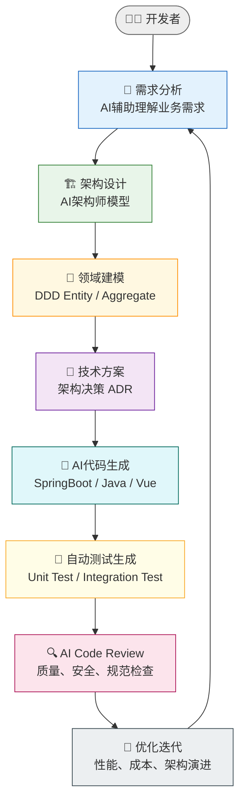
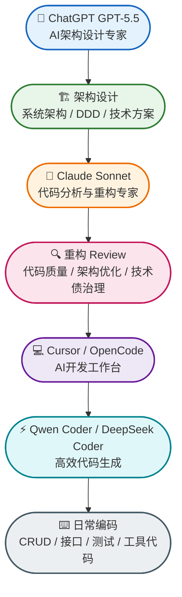
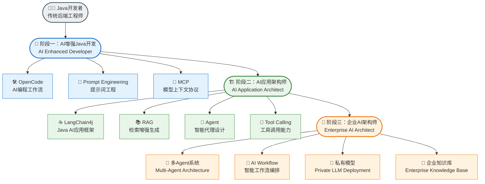

作为 Java 开发者，如何在大模型浪潮中系统性地利用 AI 提升开发效率？本文基于实际经验，梳理模型选型、开发流程、工具链与成长路线，提供一份 Java AI 开发的全景参考。

## 一、模型评估

不同开发任务对模型能力要求各异，以下矩阵涵盖 Java 后端开发的常见场景：

| 类型          | 最适合任务                        | 推荐模型                             |
| ------------- | --------------------------------- | ------------------------------------ |
| 架构设计      | 系统架构、DDD、领域建模、技术选型 | Claude Opus / GPT-5.5 / Gemini Ultra |
| 复杂代码开发  | Java、Spring、微服务、Agent       | GPT-5.5 / Claude Sonnet / DeepSeek R |
| 日常编码      | CRUD、接口、测试                  | DeepSeek Coder / Qwen Coder          |
| 大规模重构    | 老项目改造                        | Claude Sonnet / GPT-5.5              |
| 前端开发      | Vue3/Nuxt/React                   | Claude Sonnet / GPT-5.5              |
| AI Agent 开发 | LangChain4j、RAG、MCP             | GPT-5.5 / Claude                     |
| 数据分析      | SQL、BI、报表                     | GPT-5.5                              |
| 本地私有化    | 数据敏感的任务                    | Qwen3 / DeepSeek / Llama             |

## 二、开发工作流

AI 辅助开发不是把需求丢给 AI 就完事，而是一个可闭环的工程化流水线。从需求理解到持续优化，每个环节都有对应的 AI 实践：

## 三、个人工具链

不同开发阶段使用不同 AI 工具，以下是当前使用的个人工具组合：

## 四、进阶路线图

从传统后端到企业 AI 架构师，建议按以下三个阶段逐步进阶：

| 阶段           | 核心目标       | 技术关键词                              |
| -------------- | -------------- | --------------------------------------- |
| AI增强Java开发 | 提升个人生产力 | OpenCode、Prompt、MCP                   |
| AI应用架构师   | 构建AI应用     | LangChain4j、RAG、Agent                 |
| 企业AI架构师   | 设计企业AI平台 | Multi-Agent、Workflow、私有模型、知识库 |

---

AI 技术迭代极快，但核心的工程思维与架构能力是相通的。这套矩阵与路线图会跟随工具生态持续更新。

